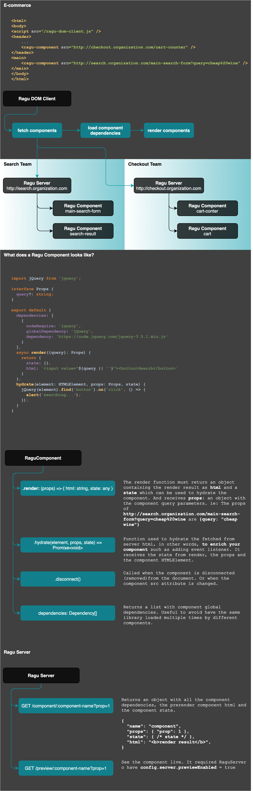

# 🔪 Ragu a micro-frontend framework

Ragu is a micro-frontend framework designed to enable multiple teams to
work at the same product but in different codebase.

## Core principles:

### No artefact integration
The most common pattern when teams want to share code is create a private
npm package and use this package across the company. One of the main
issues of this approach is that every time the shared package is updated
a new build is required for each application that used the shared package.

Read more at
[Front-end integration via artifact - ThoughtWorks Tech Radar](https://www.thoughtworks.com/en/radar/techniques/front-end-integration-via-artifact)

### Build system included
Ragu Server comes with a build system on top of webpack. :)

### Server side rendering
Ragu server enables SSR by default and exposes an API where you can get
the HTML result from any component. You can write your own Ragu client 
for any language.

Read more about [Ragu Server](https://github.com/carlosmaniero/ragu/tree/main/ragu-server)

### Framework agnostic
You can write a Ragu Component using any framework you want since they enable you to have the render result as HTML
string (such as [ReactDOMServer.renderToString](https://reactjs.org/docs/react-dom-server.html#rendertostring)) 
and have a hydration mechanism such as [ReactDOM.hydrate](https://reactjs.org/docs/react-dom.html#hydrate).

